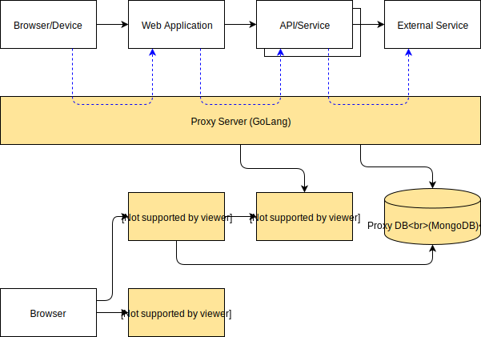

# GO Fiddle

Golang implementation of a HTTP proxy inspired by Fiddler.

The primary differentiator between GO Fiddle and Fiddler is that GO Fiddle is intended for use in distributed systems. GO Fiddle can help with debugging and troubleshooting when all HTTP/HTTPS traffic is configured to use the proxy.

GO Fiddle should not be used in production environments.

## Overview



## Getting started

Dependencies:

* `golang`
* `kafka`
* `mongodb`
* `nodejs`

Alternatively:

* `docker`
* `docker-compose`

Cloning:

```sh
# clone into GOPATH
cd $(go env GOPATH)/src
git clone https://github.com/socsieng/go-fiddle.git
cd go-fiddle
```

## Setup

In order to inspect https traffic, a certificate will need to be installed and configured.

Generating a root certificate authority:

```sh
# generates the certificate
scripts/bootstrap.sh

# install the cerificate (on macOS)
sudo security add-trusted-cert -d -r trustRoot -k /Library/Keychains/System.keychain certificates/proxy-ca.pem
```

## Usage

Using `docker-compose`:

```sh
docker-compose up
```

## Launching

In a browser, visit [http://localhost:3000/](http://localhost:3000/)

Issue a request:

```sh
curl https://www.google.com.au/ -x http://localhost:8080/ -k
```
